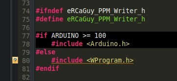
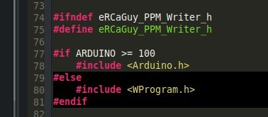

## Problem: Eclipse won't index my project correctly, and parts of it are blacked out!

Eclipse has a _really smart and good code indexer._ That's why I use it! This allows you to **Ctrl** + **Click** on any function name, `#include` file, variable, class, namespace, macro, etc., to jump to its definition! This is very handy. However, sometimes a project contains macros which are defined _only at compile time_, via the `-Dmacro=definition` option to the `gcc` or `g++` C and C++ compilers, respectively. 

Here is an example of that. The `ARDUINO` macro is not defined anywhere, so Eclipse's indexer causes that part of the code to be blacked-out, indicating it is not being used or entered, as shown here:

[](../assets/images/Selection_082.jpg)

The Arduino build system apparently must normally define this macro during building, by passing something like `-DARDUINO=120`, or similar, to the build system. So, let's just pass `-DARDUINO=1000` to the Eclipse indexer so it will see it is defined to something `> 100`, since I know it is when I build. When done following the instructions below, I see this instead:

[](../assets/images/Selection_083.jpg)


## Solution: set custom macros for a given project (affects both building and indexing in Eclipse)

Eclipse makes this rather confusing, since there are multiple places to set this, and the settings are coupled, but here's how it works, and here's my preferred way to do it:

In this example we will set the following defines _at the Eclipse project level_ (for its indexer and builder) rather than in your source code.

<!-- language: lang-cpp -->

```
#define ARDUINO 1000
#define AVR
#define __AVR_ATmega328__
```

If you were defining them at the command-line when manually building a `gcc` or `g++` project, the above `#define`s would look like this (search for `-Dmacro` in the [`man gcc`](https://linux.die.net/man/1/gcc) pages for details):

<!-- language: lang-bash -->

```
-DARDUINO=1000 -DAVR -D__AVR_ATmega328__
```

So, do the following in your Eclipse project. My project here is called "Arduino 1.8.13" (see full screenshot of this a couple images below):

**Right-click on your project** in the "Project Explorer" pane on the left --> **Properties** --> **C/C++ General** --> **Paths and Symbols** --> **Symbols** tab --> select either **GNU C** or **GNU C++** --> click the **Add** button at the top-right --> type `ARDUINO` for **name** and `1000` for **value** --> BE SURE TO CHECK THE 2 BOXES FOR **Add to all configurations** and **Add to all languages** (unless you don't want those behaviors) --> click **OK**.  
[![enter image description here][1]][1]

Repeat this step for all defines, as follows. Be sure to check the boxes for **Add to all configurations** and **Add to all languages** (unless you don't want those behaviors) for each one: 

1. Name: `ARDUINO`, Value: `1000`
1. Name: `AVR`, Value: (leave empty)
1. Name: `__AVR_ATmega328__`, Value: (leave empty)

Here's a screenshot showing the first one. Notice all the highlighted sections to click or pay attention to:

[![enter image description here][2]][2]

Once you've done this for all macros you wish to define (ex: the 3 above), you will see the following:

1. If you checked the box for **Add to all languages** for each one, then these macros will have been applied to BOTH the **GNU C** and **GNU C++** languages. So, click on one and then the other and you should see the macros in both places, like this: 
    [![enter image description here][3]][3]
1. If you checked the box for **Add to all configurations** for each one, then these macros will have also been applied to all build "Configurations", such as **Debug** and **Release**, as shown here:
    [![enter image description here][4]][4]
1. Keep in mind all of the various combinations of "Languages" and "Configuration" are unique. You can set macros for one or both languages for each configuration individually if you don't check the 2 boxes for **Add to all configurations** and **Add to all languages** when adding the macros.
1. If you navigate to _Project Properties_ --> **C/C++ Build** --> **Settings** --> **Tool Settings** tab --> **Cross GCC Compiler** --> **Preprocessor** you will also see these macros now defined for all "GCC" C files, when building or indexing!:
    [![enter image description here][5]][5]  
    Note that you can also edit, add, or delete macros specific to a given "Configuration" or "Language" (this particular place is for the **GNU C** language) right here, rather than as previously done above, if you like. **BUT, the only way to apply a given macro to ALL languages and ALL build configurations at once is doing it how I showed you above.**  
1. You can also see these macros are applied to the **GNU C++** build and index settings if you navigate to  _Project Properties_ --> **C/C++ Build** --> **Settings** --> **Tool Settings** tab --> **Cross G++ Compiler** --> **Preprocessor**:
    [![enter image description here][6]][6]  
    Again, to customize macros just for C++ and just for this selected "Configuration" you could edit them right here.

When done adding all macros, click **Apply** or **Apply and Close**. When asked, choose **YES** to re-index the entire project:  
[![enter image description here][7]][7]

If you didn't click **YES**, you may manually trigger the project to be reindexed by **right-clicking on it in the Project Explorer** and going to --> **Index** --> **Rebuild**.


## Troubleshooting

If your settings/macros don't seem to be getting applied, and your code still shows sections blacked-out, indicating the macros for those sections are false or undefined, you may need to do or check the following:

1. Try reindexing your project by **right-clicking on it in the Project Explorer** and going to --> **Index** --> **Rebuild**.
1. You may not have set the macros for the right build configuration or language. You will need to check all of the various build configurations and languages as I showed in the various screenshots above.
    1. Follow the instructions above and re-add the macros, this time BEING SURE TO CHECK THE 2 BOXES FOR **Add to all configurations** and **Add to all languages**.
    1. OR, manually navigate to the _Project Properties_ --> **C/C++ Build** --> **Settings** --> **Tool Settings** tab --> 
        1. --> **Cross GCC Compiler** --> **Preprocessor** OR 
        1. --> **Cross G++ Compiler** --> **Preprocessor**...  
    - ...sections to manually configure the macros just for one language and/or configuration, or another. ALL of these settings must be either in-sync or set individually.
1. The easiest place to set these settings, as already stated above, is here: **Right-click on your project** in the "Project Explorer" pane on the left --> **Properties** --> **C/C++ General** --> **Paths and Symbols** --> **Symbols** tab. BUT, if you forgot to check the boxes for **Add to all configurations** and **Add to all languages**, I recommend just deleting the macros and then adding them again, this time checking those boxes.
1. If you don't want to worry about which build Configuration you have selected, and you didn't check the **Add to all configurations** box when you added the macros, you can also change this global workspace setting, but I don't really recommend it:  
    **Window** --> **Preferences** --> **C/C++** --> **Indexer** --> select **Use active build configuration**. Again, however, I do NOT use this option myself and do not necessarily recommend you use it either. It's just something to be aware of is all.  
    [![enter image description here][8]][8]

----

This article is also posted as an answer on Stack Overflow here: [How can I convince Eclipse CDT that a macro is defined for source code editing and code completion?](https://stackoverflow.com/a/66094447/4561887). If you find it useful, please leave a comment here and go upvote my Stack Overflow answer there.

  [1]: https://i.stack.imgur.com/iT9LA.jpg
  [2]: https://i.stack.imgur.com/R7SBA.jpg
  [3]: https://i.stack.imgur.com/jtvR8.png
  [4]: https://i.stack.imgur.com/92sw5.png
  [5]: https://i.stack.imgur.com/TVL01.png
  [6]: https://i.stack.imgur.com/qfXEr.png
  [7]: https://i.stack.imgur.com/9cis2.png
  [8]: https://i.stack.imgur.com/GydZm.png
