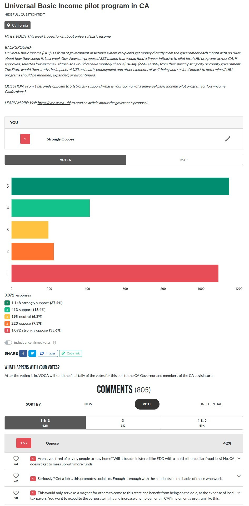

(My own words, because this program seems to be useful): help your voice be heard by policy-makers and lawmakers. If you're not signed up for VOCA yet, please go sign up. It's free and easy. Just requires a phone number so they can send you a weekly survey question, which results they share with your lawmakers: https://www.voca.vote/.

## The Question

This week's VOCA question, from here: https://www.voca.vote/r/ca_ubi:

 

> ### Universal Basic Income pilot program in CA
> 
> California
> 
> Hi, it's VOCA. This week's question is about universal basic income.
> 
> BACKGROUND:  
> Universal basic income (UBI) is a form of government assistance where recipients get money directly from the government each month with no rules about how they spend it. Last week Gov. Newsom proposed $35 million that would fund a 5-year initiative to pilot local UBI programs across CA. If approved, selected low-income Californians would receive monthly checks (usually $500-$1000) from their participating city or county government. The State would then study the impacts of UBI on health, employment and other elements of well-being and societal impact to determine if UBI programs should be modified, expanded, or discontinued.
> 
> QUESTION: From 1 (strongly oppose) to 5 (strongly support) what is your opinion of a universal basic income pilot program for low-income Californians?
> 
> LEARN MORE: Visit https://voc.as/ca_ubi to read an article about the governor's proposal.

## My Vote and Opinion

I just voted "strongly oppose", yet, [I _proudly_ voted for Biden this election](https://gabrielstaples.com/kamala-and-joe-acceptance-speeches/), and I believe _strongly_ in helping others. So, why did I oppose this initiative?

Here is my opinion:

All welfare systems should promote productivity. As far as I know, this system would remove the amount people receive once their own income exceeds a certain level, thereby incentivizing people to intentionally make LESS THAN the threshold requires to receive this income. The law needs to be written such that they are motivated to make MORE MONEY, not less. Perhaps this could be done by INCREASING the payment amount the more someone makes, until they make a certain amount, then GRADUALLY decreasing it towards zero as they make more and more of their own money, according to a *linear equation*. This should be based on a linear equation of gradual decrease, NOT on a threshold or system of income "buckets" or "brackets". Come on people (lawmakers)! Use basic algebra (rather than buckets and brackets, like we do in taxes and nearly 100% of government programs; note: we have modern computers--we are no longer in a day and age when brackets are done by necessity), AND **motivate people to make MORE money by paying them MORE the more they make, not more the LESS they make! INCENTIVIZE SELF-SUFFICIENT BEHAVIOR.**

The thing I hate seeing the most is a low-income person _intentionally_ remaining low-income so they don't exceed some arbitrary "low income" threshold, thereby losing ALL of their benefits all at once and making LESS money overall (gov't subsidy + their own income) once their own income exceeds a certain level. So, instead, pay them MORE GOV'T SUBSIDY THE MORE THEY MAKE! Again, then **gradually** decrease it according to a linear equation beyond a certain point. BUT, the key here is that as their own work income goes up, their TOTAL MONEY (gov't aid + own income) MUST ALSO GO UP so that they are ALWAYS incentivized and motivated to make MORE of their own money, NOT less. 

## The Christian perspective

Even God's inspired word, from the Bible here, seems to agree with this, and as I make observations in life I find this to be truly inspired:

[Matthew 13:12](https://www.churchofjesuschrist.org/study/scriptures/nt/matt/13.12?lang=eng&clang=eng#p12):

> 12 For whosoever hath, to him shall be given, and he shall have more abundance: but whosoever hath not, from him shall be taken away even that he hath.

READ THE FOLLOWING! THE _PARABLE OF THE TALENTS_ IS SOOOO IMPORTANT AND APPLICABLE HERE!

Note that a "talent" is a unit of _money_! [Wikipedia states](https://en.wikipedia.org/wiki/Parable_of_the_talents_or_minas) "a single talent was therefore worth 16 years of labor." To put that in perspective, perhaps that is $100k/yr x 16 yrs = $1.6M (1.6 _million_ dollars!). This parable, from Jesus Christ himself, proclaims boldly (and I agree with this!) that those who have received money, use it, and make more money with it, should be given MORE money, and those who have _not_ money, lose it, and do NOT use it should have even less ("shall be taken away even that which he hath"). However, this concept and teaching must be taken into consideration with all the scriptures, not isolated and read alone. Hence, my opinion above: help the poor, while creating proper incentives to motivate them to become richer. And, initially, as they become richer, give them MORE MONEY from the government in order to create proper rewards and incentives, NOT less. Then, when it is time to wean them off of the program and give them less, give them less *gradually* so that the extra income they make as their own income goes up is MUCH MORE THAN the losses of the government subsidy as the government subsidy is slowly removed.  

[Matthew 25:28-29](https://www.churchofjesuschrist.org/study/scriptures/nt/matt/25.28)

> 28 Take therefore the talent from him, and give it unto him which hath ten talents.
>
> 29 For unto every one that hath shall be given, and he shall have abundance: but from him that hath not shall be taken away even that which he hath.

[Luke 19:23-26](https://www.churchofjesuschrist.org/study/scriptures/nt/luke/19.23-26?lang=eng)

> 23 Wherefore then gavest not thou my money into the bank, that at my coming I might have required mine own with usury?
>
> 24 And he said unto them that stood by, Take from him the pound, and give it to him that hath ten pounds.
>
> 25 (And they said unto him, Lord, he hath ten pounds.)
> 
> 26 For I say unto you, That unto every one which hath shall be given; and from him that hath not, even that he hath shall be taken away from him.

### Read more about the Parable of the Talents here:
1. [Wikipedia: Parable of the talents or minas](https://en.wikipedia.org/wiki/Parable_of_the_talents_or_minas)
1. [Matthew 25:14–30 - _The Parable of the Talents_](https://www.churchofjesuschrist.org/study/scriptures/nt/matt/25.14-30?lang=eng)
1. [Luke 19:11–27 - _The Parable of the Talents_](https://www.churchofjesuschrist.org/study/scriptures/nt/luke/19.11-27?lang=eng)
